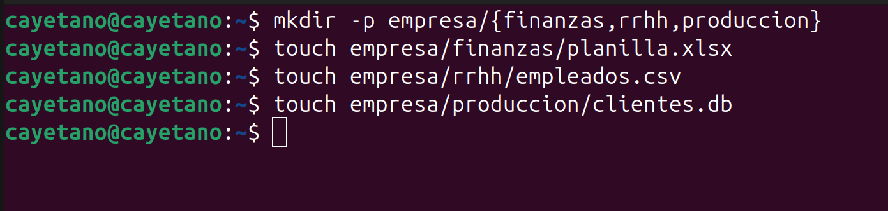

# Actividad 1
## Inventario de Activos de Información - Empresa

Este documento clasifica los activos críticos almacenados en la estructura de directorios del sistema.

| Activo | Propietario | Confidencialidad | Riesgo Asociado |
| :--- | :--- | :--- | :--- |
| `empresa/finanzas/planilla.xlsx` | Gerencia Financiera | Muy Alta | Divulgación de estados financieros y datos sensibles de nómina. |
| `empresa/rrhh/empleados.csv` | Departamento de RRHH | Crítica | Fuga de datos personales (PII) e incumplimiento legal. |
| `empresa/produccion/clientes.db` | Gerencia de Operaciones | Alta | Pérdida de ventaja competitiva y exposición de cartera. |

---
## Notas de Clasificación
* **Confidencialidad:** Basada en el impacto de una posible brecha de seguridad.
* **Riesgo:** Representa la amenaza principal a la tríada de la seguridad (Confidencialidad, Integridad y Disponibilidad).




# Actividad 2
# Reporte de Auditoría de Permisos - Actividad 2

## 1. Escenario de Riesgo
Se identificó una configuración insegura en los archivos críticos del sistema, donde se asignaron permisos `777` (acceso total a todos los usuarios).

## 2. Análisis de Incumplimiento
* **¿Existe incumplimiento?** Sí. Se vulneró el Principio de Menor Privilegio.
* **¿Qué riesgo genera?** 
    * **Confidencialidad:** Exposición de datos sensibles (salarios, datos personales) a usuarios no autorizados.
    * **Integridad:** Posibilidad de modificación o eliminación accidental o malintencionada por terceros.
    * **Ejecución:** Riesgo de ejecución de scripts no autorizados debido al permiso de ejecución (`x`).
* **¿Qué control ISO 27001 aplica?**
    * **A.9.4.1 (Restricción de acceso a la información):** Los accesos a la información y a las funciones de aplicación deben restringirse de acuerdo con la política de control de acceso.

## 3. Acciones de Corrección
Se aplicó una restricción de permisos a `640` (rw-r-----), asegurando que solo el propietario y el grupo tengan acceso a la lectura y escritura, bloqueando el acceso a otros usuarios.

```bash
chmod 640 empresa/finanzas/planilla.xlsx
chmod 640 empresa/rrhh/empleados.csv
```
